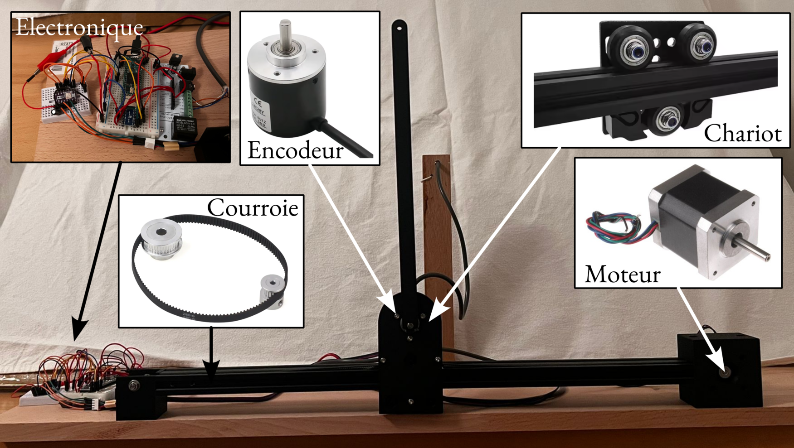

# Inverted Pendulum

Active stabilization of an inverted pendulum on a cart, built from a recycled
3D printer (Alfawise U20). The system is controlled by a Teensy 4.1
microcontroller running a 1 kHz feedback loop, and monitored via a PyQt5 GUI.



## Repository Structure

```
teensy/     Embedded firmware (PlatformIO / Arduino)
model/      Python simulation and control design
gui/        Real-time control interface (PyQt5)
tools/      Data capture and analysis scripts
data/       Recorded experiment CSV files
figs/       Generated figures
docs/       Hardware datasheets
```

## Hardware

| Component | Details |
|-----------|---------|
| Microcontroller | Teensy 4.1 |
| Stepper motor | DRV8825 driver, 32 microsteps, 5 µm/step |
| Pendulum encoder | Quadrature, 4096 steps/rev → 0.088°/step |
| Cart travel | ±200 mm hard stop, ±160 mm soft limit |
| Control rate | 1 kHz (`IntervalTimer`) |

---

## 1 — Teensy Firmware

### Dependencies

- [PlatformIO](https://platformio.org/) (CLI or VS Code extension)
- Encoder library by Paul Stoffregen (declared in `teensy/platformio.ini`)

### Build and Flash

```bash
cd teensy/
pio run -e teensy41                # build only
pio run -e teensy41 -t upload      # build + flash
```

### Serial Monitor

```bash
pio device monitor                 # 115200 baud
```

### Serial Commands

Once the firmware is running, commands can be sent via the GUI or any serial
terminal at 115200 baud:

| Command | Description |
|---------|-------------|
| `MOTOR ON` / `MOTOR OFF` | Enable / disable stepper motor |
| `FB ON` / `FB OFF` | Close / open feedback loop |
| `ZERO CART` | Reset cart position to 0 |
| `ZERO ENC` | Reset pendulum encoder to 0 |
| `VEL <mm/s>` | Open-loop cart velocity |
| `MODE P` / `MODE PD` / `MODE LQR` | Select controller |
| `SET KP <val>` | Proportional gain (SI units) |
| `SET KD <val>` | Derivative gain (SI units) |
| `SET K <k0> <k1> <k2> <k3>` | LQR gain vector [x, ẋ, φ, φ̇] |
| `SET THETA <deg>` | Pendulum angle setpoint |
| `SET X <mm>` | Cart position setpoint |

### Controllers (all gains in SI units)

- **P**: `u = -Kp · φ`
- **PD**: `u = -Kp · φ - Kd · φ̇`
- **LQR**: `u = -K · [x, ẋ, φ, φ̇]`

where `u` is cart acceleration [m/s²] and `φ = θ − π` is the deviation from
the upright position.

---

## 2 — GUI

### Setup (first time)

```bash
cd gui/
python -m venv .venv
source .venv/bin/activate
pip install PyQt5 pyqtgraph pyserial numpy scipy colorama
```

### Run

```bash
source gui/.venv/bin/activate
python gui/program.py
```

Connects to the Teensy at `/dev/ttyACM0`, 115200 baud. The interface provides:

- **Controller panel** — mode selection (P / PD / LQR), gain entry
- **Setpoints panel** — θ_ref and x_ref
- **Motor control** — enable/disable motor and feedback, zero buttons,
  open-loop velocity slider
- **Data panel** — save telemetry to CSV

---

## 3 — Model & Simulation

### Setup (first time)

```bash
cd model/
python -m venv .venv
source .venv/bin/activate
pip install numpy matplotlib scipy control
```

### Run

```bash
source model/.venv/bin/activate
python model/inverted_pendulum.py
```

Generates simulation figures in `figs/`: open-loop responses, P/PD stability
boundaries, LQR and LQG results.

### System Model

Linearized equations of motion around the upright position (φ = θ − π ≈ 0):

```
D · φ̈ + c · φ̇ − mgl · φ = ml · u
```

State-space form with **X = [x, ẋ, φ, φ̇]**, input **u = ẍ** [m/s²]:

```
Ẋ = A·X + B·u
```

Parameters identified from free-response measurement (`tools/fit.py`):

| Parameter | Symbol | Value |
|-----------|--------|-------|
| Pendulum mass | m | 0.1 kg |
| Pendulum length (half) | l | 0.326 m |
| Friction coefficient | c | 3.4 × 10⁻⁴ N·m·s/rad |

---

## 4 — Tools

All tools use the GUI virtual environment:

```bash
source gui/.venv/bin/activate
```

### Capture telemetry

```bash
python tools/capture.py                          # 10 s → data/data.csv
python tools/capture.py -d 30 -o data/run.csv   # 30 s to custom file
python tools/capture.py -d 10 -p /dev/ttyACM1   # custom port
```

### Fit model parameters

```bash
python tools/fit.py data/free_response.csv --mass 0.1
```

Fits pendulum length `l` and friction `c` to a free-response recording using
Nelder-Mead optimisation. Saves `figs/<name>_data.png` and
`figs/<name>_fit.png`.

Options: `--mass`, `--t-start`, `--l-init`, `--c-init`

### Plot experiment

```bash
python tools/plot_experiment.py data/run.csv
python tools/plot_experiment.py data/run.csv --ylim-phi 5 --ylim-x 100
python tools/plot_experiment.py data/run.csv --split --zero-at-feedback
python tools/plot_experiment.py data/run.csv --all --detrend-x --no-shading
```

Plots the last closed-loop segment of a CSV recording (φ and cart position).

| Option | Description |
|--------|-------------|
| `--all` | Plot entire file instead of last segment |
| `--margin <s>` | Time margin before/after segment (default: 1 s) |
| `--margin-after <s>` | Override margin after segment |
| `--ylim-phi <deg>` | ±limit on φ axis |
| `--ylim-x <mm>` | ±limit on cart position axis |
| `--detrend-x` | Remove mean from cart position |
| `--no-shading` | Hide green feedback-on shading |
| `--split` | Save separate `_phi.png` and `_x.png` figures (half-width) |
| `--zero-at-feedback` | Set t = 0 at feedback start |

### Plot stability

```bash
python tools/plot_stability.py data/run.csv --duration 20
python tools/plot_stability.py data/run.csv --duration 30 --ylim-phi 3 --ylim-x 10
```

Plots the last N seconds of a recording to visualise closed-loop stability.

---

## 5 — Typical Workflow

### Initial setup

1. Flash the firmware: `cd teensy && pio run -e teensy41 -t upload`
2. Start the GUI: `source gui/.venv/bin/activate && python gui/program.py`
3. Enable the motor (**Motor ON**), zero the cart and encoder

### Identify model parameters

1. Place pendulum hanging freely (θ ≈ 0°)
2. Give it a small push and record 10–50 s of free oscillation:
   ```bash
   python tools/capture.py -d 50 -o data/free_response.csv
   ```
3. Fit the model:
   ```bash
   python tools/fit.py data/free_response.csv --mass <m_kg>
   ```
4. Update `PendulumParameters` in `model/inverted_pendulum.py` with the
   fitted values

### Tune and run a controller

1. In the GUI, set **MODE PD** and enter Kp / Kd
2. Bring the pendulum near upright and press **FB ON**
3. Save data with **Save CSV**, then analyse:
   ```bash
   python tools/plot_experiment.py data/<run>.csv --split --zero-at-feedback --ylim-phi 5
   ```

### LQR synthesis

```bash
source model/.venv/bin/activate
python model/inverted_pendulum.py   # prints K vector
```

Enter the resulting K in the GUI under **LQR gains**, switch to **MODE LQR**.

---

## 6 — Demonstrations

### System identification — free oscillation response

https://github.com/user-attachments/assets/movies/inverted_pendulum_identification.mp4

Free oscillation of the pendulum used to identify the model parameters (length $l$, friction coefficient $c$) via least-squares fitting.

---

### PD control — stabilization

https://github.com/user-attachments/assets/movies/inverted_pendulum_pd_control.mp4

Pendulum stabilized at the upright position using a PD controller. The pendulum angle is regulated but the cart drifts over time.

---

### PD control — damping only

https://github.com/user-attachments/assets/movies/inverted_pendulum_damping_control.mp4

Controller acting primarily as a damper, slowing down the pendulum dynamics without full stabilization.

---

### LQR — low gain

https://github.com/user-attachments/assets/movies/inverted_pendulum_lqr_low_gain.mp4

LQR with low state weighting: the controller stabilizes the pendulum with slow, smooth corrections.

---

### LQR — high gain

https://github.com/user-attachments/assets/movies/inverted_pendulum_lqr_high_gain.mp4

LQR with higher gain: faster correction of angle and cart position deviations.

---

### LQR — higher gain (close view)

https://github.com/user-attachments/assets/movies/inverted_pendulum_lqr_higher_gain_closer.mp4

Close-up view of the pendulum with higher LQR gains, showing the fast angular stabilization.

---

### LQR — higher gain

https://github.com/user-attachments/assets/movies/inverted_pendulum_lqr_higher_gain.mp4

Wide view of the same higher-gain LQR configuration, showing simultaneous control of both angle and cart position.

---

### LQR — changing cart position setpoint

https://github.com/user-attachments/assets/movies/inverted_pendulum_lqr_change_x_setpoint.mp4

LQR controller tracking a step change in the cart position setpoint $x_\mathrm{ref}$, while keeping the pendulum upright.
